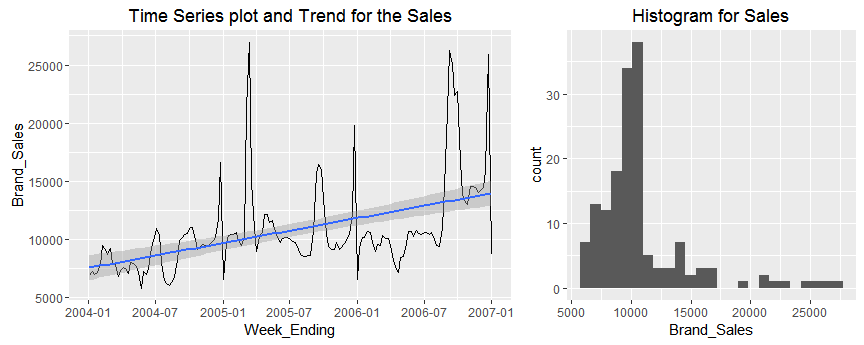
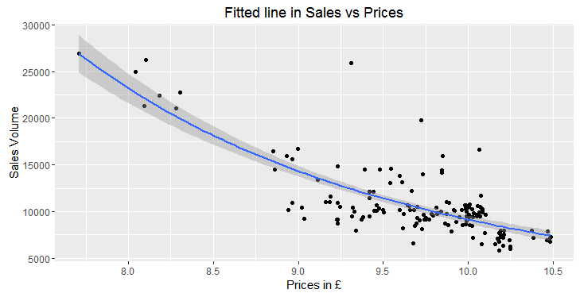
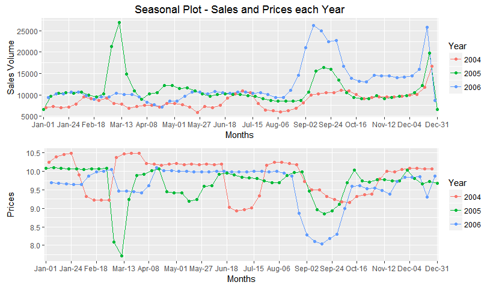
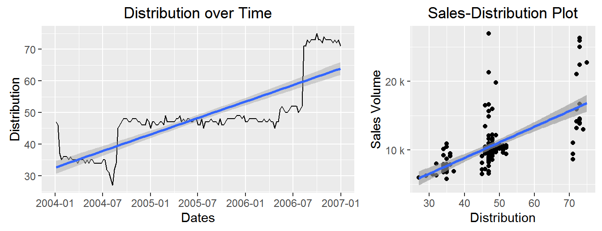
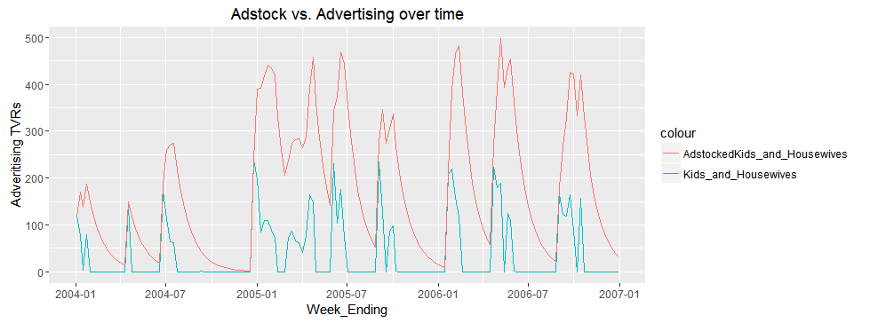
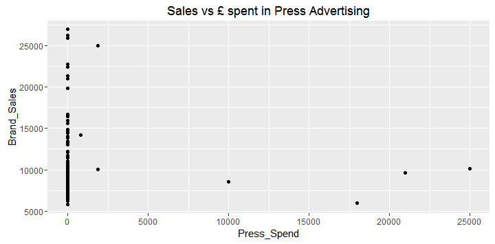
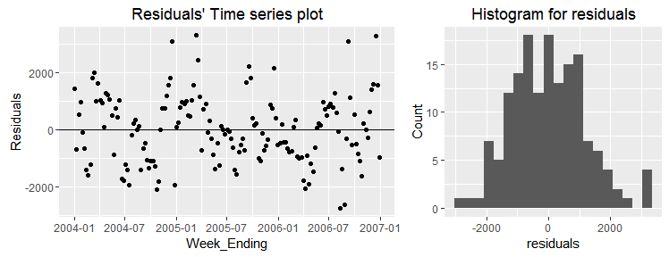
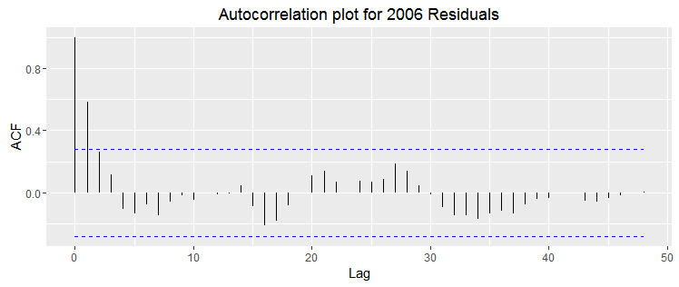

# Marketing Mix Modelling Analysis
Arjun Dutta  
20 September 2018  


In this statistical analysis I fitted a multivariate regression model on simulations of Sales and marketing series data (i.e. Advertising, Distribution, Pricing) to estimate the impact of various marketing tactics on sales and then forecast the impact of future sets of tactics.

The initial discovery of relationships is done with a training set while a test set is used for evaluating whether the discovered relationships hold.

Transformation and adjustment techniques are also applied (Adstocks, log-log, adding ordinal predictors) so that the data would meet the assumptions of the statistical inference procedure and to reduce the variability of forecasts.


### Loading and description of Data

Below I load the tables from the excel file.


```r
#created a pricing variable in excel equal with values/volume
#create data frames
require(XLConnect)
wb = loadWorkbook("data.xls")
MData = readWorksheet(wb, sheet = 1, header = TRUE)
names(MData)[c(1,2,6,7,8,9)] <- c("Week_Ending", "Brand_Sales","Press_Spend", "HWivesTVR", "Kids_TVR","SponsorTVR")
```


The dataset:

**Brand Sales Volume Kg**: Cumulative sales volume in kg till the weekend date for a Brand's product

**Brand Sales Volume £**: Cumulative sales Value in £ till the weekend date

**Brand Pricing**: Average Price during the weekend date

**Brand Sterling Wtd distribution**: Distribution of the brand's product on several interconnected intermediaries along the way such as wholesalers, distributers, agents and retailers.

**Promotion distribution**: Three types of marketing activities executed by the business/brand in interconnected intermediaries. This type of promotion affects only the distribution variable which subsequently affects the Sales.

**Housewives, Kids and Sponsorship TVRs**: Three TV advertising variables that measure the total of all rating points during the brand's advertising campaign.

**TV Spend £**: Money spent by the Brand/Business in TV Advertising during the weekend date.

**Press Spend £**: Money spent by the Brand/Business in Press Advertising during the weekend date.
<br>

### Training and Test set partition

In Time Series analysis and forecasting it is advised to leave a portion from the left or right part of the sample data for **testing**, i.e., not to use this part during learning, but to use it to test how successfully the forecasting model predicts our data. The rest of the sample's part will be the **training test** which will be implemented to build up the model.

<i><font face="Geneva" size="2">Example: Time series Training-Test set partition</font></i>


In our dataset the training-set will be all data from `2004` to `2006`, and the test-set the `2007` data.


```r
TrainData <- MData[4:160,]
TestData <- MData[161:length(MData[,1]),]
```


### Brand's Sales Perfomance

I will first check how Sales behave over time and their distribution:


```r
library(ggplot2)
require(gridExtra)
plot1 <- ggplot(TrainData, aes(x=Week_Ending, y=Brand_Sales)) + geom_line() + geom_smooth(method=lm) + ggtitle("Time Series plot and Trend for the Sales")
trendfit <- lm(Brand_Sales ~ Week_Ending, TrainData)
plot2 <- ggplot(TrainData, aes(Brand_Sales)) + geom_histogram(bins=25) + ggtitle("Histogram for Sales")
grid.arrange(plot1, plot2, widths = c(3,2) , heights=2 , ncol=2, nrow=1)
```



- The histogram shows that our response's variable is **right skewed**, therefore some transformations must be implemented so that the data would meet the regression's assumptions.

- The time series plot also shows an increasing **trend** over time


```r
corMatrix <-cor(TrainData[,c("Brand_Sales","Week_ending", "Prices", "Distribution", "HWivesTVR", "Kids_TVR", "SponsorTVR", "Press_Spend")])
library(plotrix)
color2D.matplot(corMatrix, show.values = 2, axes=FALSE, xlab="",ylab="", main="Association matrix for all Variables")
axis(1,at=c(seq(from=0.5,to=7.5,by=1)),labels=colnames(corMatrix), cex.axis=0.55)
axis(2,at=c(seq(from=0.5,to=7.5,by=1)),labels=rev(colnames(corMatrix)), las=2, cex.axis=0.55)
```


From the correlation matrix we can notice that:

- Sales variable is significantly related with **Prices**, **Distribution** and **Time** (Week_ending).

- All correlation coefficients with **Advertising** and Sales are low. This is expected since the ads' carry-over effect has not been yet considered.

- Distribution and Time are highly correlated hence we suspect that the observed trend was possibly casually related with the brand's Distribution.


### Pricing

The plot below shows that price changes of the 9th brand variant significantly impacts sales negatively. Also the relationship seems to be monomial of the form <b><i><font face="sans-serif" size="2.5">y=ax<sup>k</sup></font></i></b> instead of linear, therefore I transformed the x variable respectively:


```r
##use log-log transformation to calculate the power (k) of the monomial:
fit<-lm(log(Brand_Sales)~log(Prices), data=TrainData)
##beta coefficient equals bo=17.87 and a=-3.908
##That means that the relationship is
## log(y)=17.8686 -3.7977*log(x) <=>
## y = e^(17.8686 -3.7977*log(x)) <=>
## y = e^17.8686 * e^log(x^(-3.7977)) <=>
## y = 57575057 * x^(-3.7977) 
fit<-lm(Brand_Sales ~ 0 + I(Prices^(-3.7977)), data=TrainData)
## the coefficient estimated with the monomial formula is almost equal with the log-log formula 

ggplot(TrainData, aes(x=Prices, y=(Brand_Sales))) +  geom_point() + geom_smooth(method=lm, formula=y~I(x^(-3.7977))) + xlab("Prices in £") + ylab("Sales Volume") +ggtitle("Fitted line in Sales vs Prices")
```




### Seasoning

When looking at the plot below we see that sales have increased drasticly over the **Christmas** period each year, specifically increased from the week starting at the 18th of december to 28th, and decreased from weeks starting from 29 to 3 of january.

There is also a strong seasonal period over the **Sales period** of september. Nevertheless the respective pricing seasonal graph clearly shows that the september seasonality can be explained quite well by the `Prices` variable and therefore we will ignore it.



This Seasonality can be estimated by inserting a **three level** ordinal predictor variable in the model:


```
## Analysis of Variance Table
## 
## Response: TrainData$Brand_Sales
##                   Df     Sum Sq    Mean Sq F value    Pr(>F)    
## TrainData$Season   3 1.8492e+10 6163912092  470.87 < 2.2e-16 ***
## Residuals        154 2.0159e+09   13090411                      
## ---
## Signif. codes:  0 '***' 0.001 '**' 0.01 '*' 0.05 '.' 0.1 ' ' 1
```

From the graph and Anova's p-value, we come to the conclusion that the ordinal variable explains quite well the seasonality in sales, so we are confident to use it in our mixed marketing model.

### Distribution

When looking at the scatterplot below (2nd plot), we come to the conclusion that `Distribution` affects significantly the Brand's Sales. Also given the assumption that the relationship between the two variables is liner, the fitted line's slope is approximately equal with the **trend's slope** coefficient, which confirms our suspicion that the trend we identified in the Sales volume is explained by the Distribution variable.


```r
## Plot Sales against distribution
plot1 <- ggplot(TrainData, aes(x=Week_Ending, y=Distribution)) +  geom_line() + xlab("Dates") + ylab("Distribution") + ggtitle("Distribution over Time") + geom_smooth(method=lm)

plot2 <- ggplot(TrainData, aes(x=Distribution, y=Brand_Sales)) +  geom_point() +  geom_smooth(method=lm) + geom_smooth(method=lm) +
  xlab("Distribution") + 
  ylab("Sales Volume") + ggtitle("Sales-Distribution Plot") + scale_y_continuous(labels=format_si())

grid.arrange(plot1, plot2, widths = c(3,2) , heights=2 , ncol=2, nrow=1)
```





#### Ongoing Marketing mix modeling 

Before testing the media variables I will fit and check the model with the variables we explored till now:

<b>Response Variable:</b>

* Brand's Sales Volume  (Continuous)

<b>Predictor Variables:</b> 

1. Prices of response variable (Continuous)

2. Distribution of products (Ordinal)

3. Seasonality (Ordinal)


```r
OnGoing <- lm(Brand_Sales ~ I(Prices^(-3.7977)) + Distribution + Season, data=TrainData)
summary(OnGoing)
```

```
## 
## Call:
## lm(formula = Brand_Sales ~ I(Prices^(-3.7977)) + Distribution + 
##     Season, data = TrainData)
## 
## Residuals:
##     Min      1Q  Median      3Q     Max 
## -3215.1  -852.4    89.1   778.0  3299.2 
## 
## Coefficients:
##                       Estimate Std. Error t value Pr(>|t|)    
## (Intercept)         -8.753e+03  8.133e+02 -10.763  < 2e-16 ***
## I(Prices^(-3.7977))  5.389e+07  2.333e+06  23.093  < 2e-16 ***
## Distribution         1.370e+02  9.823e+00  13.948  < 2e-16 ***
## Season0              2.898e+03  6.430e+02   4.507  1.3e-05 ***
## Season1              1.209e+04  9.631e+02  12.555  < 2e-16 ***
## ---
## Signif. codes:  0 '***' 0.001 '**' 0.01 '*' 0.05 '.' 0.1 ' ' 1
## 
## Residual standard error: 1260 on 152 degrees of freedom
## Multiple R-squared:  0.8983,	Adjusted R-squared:  0.8956 
## F-statistic: 335.6 on 4 and 152 DF,  p-value: < 2.2e-16
```

All p-values for the multi regression coefficients are smaller than the critical value a=0.05. 

Also the Adjusted R-squared for the current model is equal to 0.896 which indicates that 
**89.6%** of the variation in `Brand_Sales` is exlained by the current model. 

### Media

TV Advertising affects present and future sales due to its carry-over effect, whereby the impact of adverting on sales can occur during a subsequent time period. This aspect can be controlled with adstock transformation which measures the decaying and diminishing returns effect of advertising throughout the weeks.

By assuming that the output ad variable depends linearly only on its own previous value, I will use the autoregressive (AR<sub>1</sub>) formula for calculating the advertising adstocks:

<b><i><font face="sans-serif">A<sub>t</sub> = X<sub>t</sub> + adstock rate*A<sub>t-1</sub></font></i></b>

where A<sub>t</sub> is the transformed Advertising value (adstock) in time period t, X<sub>t</sub> the value of the advertising variable at time t, A<sub>t-1</sub> the adstock in the previous period t-1 and adstock rate a coefficient derived through Least Squares Method. 

The advertising variables with carry-over effects that will be transformed to adstocks, are _Housewives_ and _Kids_ and _Sponsorships_ TVRs. 


```r
Sales <- TrainData$Brand_Sales
HWivesTVR <- TrainData$HWivesTVR
Kids_TVR <- TrainData$Kids_TVR
SponsorTVR <- TrainData$SponsorTVR

ggplot(TrainData, aes(Week_Ending)) + 
  geom_line(aes(y = HWivesTVR, colour = "HWivesTVR")) + 
  geom_line(aes(y = Kids_TVR, colour = "Kids_TVR")) +
  geom_line(aes(y = SponsorTVR, colour = "SponsorTVR")) + ylab("Adveritising TVRs") +
  ggtitle("Ads' TVRs over time")
```


The Housewives and Kids TVRs are highly correlated with each other and also from the correlation matrix we can see that both affect Sales approximately equally (cor coefficients&asymp;0.2). So since they are both measured in the same unit (TVR), I will merge them to one variable by adding each week's respective values of the two ads.


```r
Kids_and_Housewives <- HWivesTVR+Kids_TVR
TrainData["Kids_and_Housewives"] <- Kids_and_Housewives
```

<br>

#### Adstock transformation:

First I will find the optimum Adstock Rate coefficient for the transformation. The best approach for deriving the adstock rate is by fitting separate regression models for a range of potential adstock rates; the optimum adstock coefficient will be the one, for which the minimum MSE and biggest R<sup>2</sup> is obtained.


```r
###Create adstocks for Kids_and_Housewives

##First find best adstock rate
AdstockRate <- seq(0.1, 1, 0.01)
TrainData$AdstockedKids_and_Housewives = numeric(length(Kids_and_Housewives))
TrainData$AdstockedKids_and_Housewives[1] = Kids_and_Housewives[1]
comb <- data.frame(AdstockRate, sigmas = rep(NA, times = length(AdstockRate)), r.squared = rep(NA, times = length(AdstockRate)))

for (i in 1:length(AdstockRate)){
  for(j in 2:length(Kids_and_Housewives)){
      TrainData$AdstockedKids_and_Housewives[j] = Kids_and_Housewives[j] + AdstockRate[i] * TrainData$AdstockedKids_and_Housewives[j-1]
      #each advertising value (volume) is transformed and equal as the value plus a percentage 
      #of the previous transfromed value.
  }
  modFit = lm(Brand_Sales ~ I(Prices^(-3.7977)) + Distribution + Season + AdstockedKids_and_Housewives, data=TrainData)
  comb[i,2] = summary(modFit)$sigma
  comb[i,3] = summary(modFit)$r.squared
}

##check if min MSE is accompanied with the highest R Squared coefficient of determination.
all.equal(comb[comb$sigmas == min(comb$sigmas),1], comb[comb$r.squared == max(comb$r.squared),1])
##the optimal Adstock Rate
fitted_AdRate <- comb[comb$sigmas == min(comb$sigmas),1]

for(j in 2:length(Kids_and_Housewives)){
      TrainData$AdstockedKids_and_Housewives[j] = Kids_and_Housewives[j] + fitted_AdRate * TrainData$AdstockedKids_and_Housewives[j-1]
      #each advertising value (volume) is transformed and equal as the value plus a percentage 
      #of the previous transfromed value.
  }

ggplot(TrainData, aes(Week_Ending)) + 
  geom_line(aes(y = Kids_and_Housewives, colour = "Kids_and_Housewives")) + 
  geom_line(aes(y = AdstockedKids_and_Housewives, colour = "AdstockedKids_and_Housewives")) + ylab("Adveritising TVRs") + ggtitle("Adstock vs. Advertising over time")
```




By comparing the two lines in the graph, we can see how adstock measures the memory effect of advertising carried over from start of each advertising.


```r
##The model
Modfit <- lm(Brand_Sales ~ I(Prices^(-3.7977)) + Distribution + Season + AdstockedKids_and_Housewives + AdstockedSponsorTVR, data=TrainData)

summary(Modfit)
```

```
## 
## Call:
## lm(formula = Brand_Sales ~ I(Prices^(-3.7977)) + Distribution + 
##     Season + AdstockedKids_and_Housewives + AdstockedSponsorTVR, 
##     data = TrainData)
## 
## Residuals:
##     Min      1Q  Median      3Q     Max 
## -2798.7  -812.6    33.3   848.4  3247.7 
## 
## Coefficients:
##                                Estimate Std. Error t value Pr(>|t|)    
## (Intercept)                  -8.723e+03  7.825e+02 -11.148  < 2e-16 ***
## I(Prices^(-3.7977))           5.290e+07  2.256e+06  23.450  < 2e-16 ***
## Distribution                  1.330e+02  9.493e+00  14.008  < 2e-16 ***
## Season0                       2.809e+03  6.186e+02   4.541 1.14e-05 ***
## Season1                       1.224e+04  9.259e+02  13.222  < 2e-16 ***
## AdstockedKids_and_Housewives  2.629e+00  6.914e-01   3.802 0.000208 ***
## AdstockedSponsorTVR          -9.115e+00  1.123e+01  -0.812 0.418302    
## ---
## Signif. codes:  0 '***' 0.001 '**' 0.01 '*' 0.05 '.' 0.1 ' ' 1
## 
## Residual standard error: 1210 on 150 degrees of freedom
## Multiple R-squared:  0.9074,	Adjusted R-squared:  0.9037 
## F-statistic: 245.1 on 6 and 150 DF,  p-value: < 2.2e-16
```

The  p-value for the coefficient of Kids/Housewives adstock is below the critical value a=0.05. On the other hand the  p-value for the coefficient of  TV sponsorship is very high and so it should be excluded from the model. 

Also when comparing the R<sup>2</sup> and MSE of the current and previous model we can see that the adstocked variable interprets only **0.81%** extra variability in the `Brand_Sales` and that the model's standard error is not increased at all. 

#### Press 

Press Advertising is described in our data only as money spent in each respective week and most of the values are equal to zero, hence I will replace this variable with a 3 level ordinal variable indicating the size of investment. The coefficients for each ordinal value will explain the average increase in Sales volume when an investment in Press occurs with a specific cost range occurs, with the rest of the predictors' values fixed.

Also I will assume that there is no carry-over component in Press advertising. In other words each week<sub>t</sub>'s press ad investments only affect sales of that same week.


```r
##Most press efforts are equal to zero:
ggplot(TrainData, aes(Press_Spend,Brand_Sales)) + geom_point() + ggtitle("Sales vs £ spent in Press Advertising")
```



```r
##Ordinal
TrainData$PressFactor <- rep(0, length(TrainData$Press_Spend))
TrainData$PressFactor[TrainData$Press_Spend>0 & TrainData$Press_Spend<=10000] <- 1
TrainData$PressFactor[TrainData$Press_Spend>10000] <- 2
TrainData$PressFactor <- as.factor(TrainData$PressFactor)

modFit <- lm(Brand_Sales ~ I(Prices^(-3.7977)) + Distribution + Season + AdstockedKids_and_Housewives + PressFactor, data=TrainData)
summary(modFit)
```

```
## 
## Call:
## lm(formula = Brand_Sales ~ I(Prices^(-3.7977)) + Distribution + 
##     Season + AdstockedKids_and_Housewives + PressFactor, data = TrainData)
## 
## Residuals:
##     Min      1Q  Median      3Q     Max 
## -2731.5  -879.8    -5.0   772.6  3322.7 
## 
## Coefficients:
##                                Estimate Std. Error t value Pr(>|t|)    
## (Intercept)                  -8.686e+03  7.910e+02 -10.981  < 2e-16 ***
## I(Prices^(-3.7977))           5.282e+07  2.273e+06  23.242  < 2e-16 ***
## Distribution                  1.321e+02  9.661e+00  13.678  < 2e-16 ***
## Season0                       2.780e+03  6.210e+02   4.476  1.5e-05 ***
## Season1                       1.223e+04  9.292e+02  13.161  < 2e-16 ***
## AdstockedKids_and_Housewives  2.602e+00  7.025e-01   3.703 0.000299 ***
## PressFactor1                  4.309e+02  6.273e+02   0.687 0.493231    
## PressFactor2                 -1.544e+02  7.212e+02  -0.214 0.830725    
## ---
## Signif. codes:  0 '***' 0.001 '**' 0.01 '*' 0.05 '.' 0.1 ' ' 1
## 
## Residual standard error: 1214 on 149 degrees of freedom
## Multiple R-squared:  0.9073,	Adjusted R-squared:  0.903 
## F-statistic: 208.4 on 7 and 149 DF,  p-value: < 2.2e-16
```

Press ordinally variable should be excluded from the model since all respective coefficients have p-values above the critical level.

### Final Model


```r
FinModel <- lm(Brand_Sales ~ I(Prices^(-3.7977)) + Distribution + Season + AdstockedKids_and_Housewives, data=TrainData)
summary(FinModel)
```

```
## 
## Call:
## lm(formula = Brand_Sales ~ I(Prices^(-3.7977)) + Distribution + 
##     Season + AdstockedKids_and_Housewives, data = TrainData)
## 
## Residuals:
##     Min      1Q  Median      3Q     Max 
## -2766.2  -875.1   -19.8   814.7  3295.1 
## 
## Coefficients:
##                                Estimate Std. Error t value Pr(>|t|)    
## (Intercept)                  -8.761e+03  7.802e+02 -11.229  < 2e-16 ***
## I(Prices^(-3.7977))           5.291e+07  2.254e+06  23.479  < 2e-16 ***
## Distribution                  1.333e+02  9.474e+00  14.072  < 2e-16 ***
## Season0                       2.792e+03  6.175e+02   4.521 1.24e-05 ***
## Season1                       1.222e+04  9.246e+02  13.220  < 2e-16 ***
## AdstockedKids_and_Housewives  2.594e+00  6.893e-01   3.764 0.000239 ***
## ---
## Signif. codes:  0 '***' 0.001 '**' 0.01 '*' 0.05 '.' 0.1 ' ' 1
## 
## Residual standard error: 1208 on 151 degrees of freedom
## Multiple R-squared:  0.907,	Adjusted R-squared:  0.9039 
## F-statistic: 294.6 on 5 and 151 DF,  p-value: < 2.2e-16
```


The Adjusted R<sup>2</sup> for the final model is eventually equal with **0.904**.

Also all p-values for the coefficients are very small and the expected standard error of the residuals is equal with *2095*. 

### Model Diagnostics

Before forecasting the data in the test set, we need to assess the validity of a model and examine if the multivariate regression assumptions are met.

When looking at the graphical diagnostic results below we conclude that:

- The variance of the residuals is approximately equal over the whole period (see Residuals Time Series plot).

- The points are not fully randomly arranged over time since weak autoregressive trends are still present (see "Residuals Time Series" plot and "Autocorrelation for 2006 residiuals" plot). 

- There are three residual points with high values (not outliers) and relatively high leverage (see "Residuals vs Leverage" plot). The two of these three values appear within the Christmas period (see "Residuals' Time series" plot), hence we should improve the interpretability of the `Season` custom variable.

- The Errors are approximately normally distributed with a slight right skeweness present (see Histogram and Q-Q plot)

- In the range of ten to thirteen thousand sales volume a significant part of negative errors is present (see "Residuals vs Fitted" diagnostic plot).  In order to identify this trend we should further explore our dataset or add extra predictors.







This final model can be used to forecast future Sales given future tactics, by adding in the regression formula the respective values of the model's variables:

1. the time period of interest

2. Planed Prices for the product in the respective period

3. The estimated product ditribution for the respective period

3. TVRs of the planned Investments in TV advertising

4. The respective seasonal ordinal values, if the period includes the Christmas season.


## Model Testing

Here we will run our model on the unseen 2007 dataset and by comparing the predicted with the observed Sales for 2007, we will determine whether the model's guesses are sufficient.


```r
TestData$PredictedSales_2007 <- FinModel$coef[1] + FinModel$coef[2]*Prices_Transformed + FinModel$coef[3]*Distribution + FinModel$coef[4]*Season0 + FinModel$coef[5]*Season1 + FinModel$coef[6]*Adstocked_Kids_Housewives
```

When looking at the comparison plots below we come to the conclusion that our model forecasts quite well future sales. 


